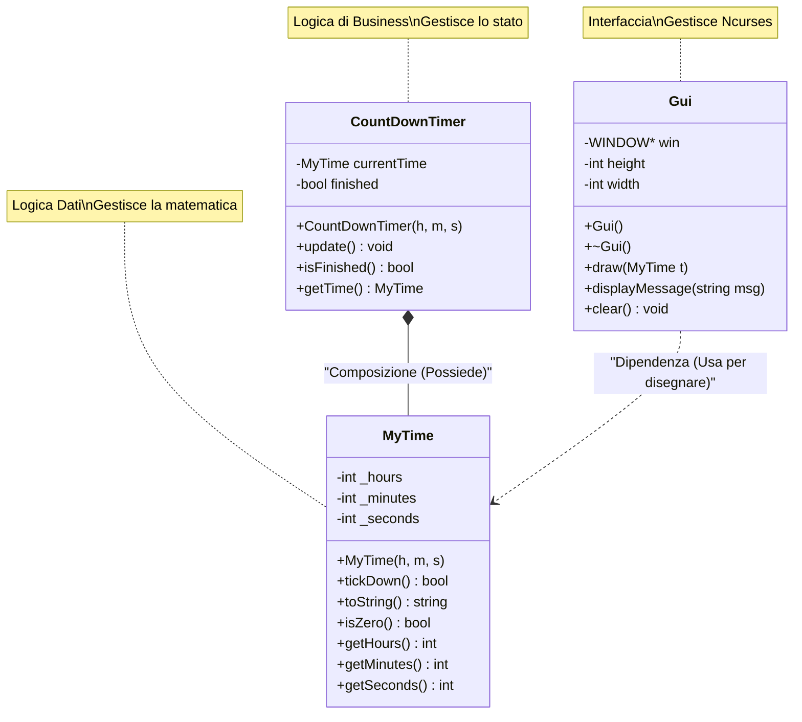

# ️⏲️ Countdown Timer Project (C++ & Ncurses)

Applicazione su terminale per il conto alla rovescia, sviluppata in C++ 11 utilizzando la libreria **ncurses** per l'interfaccia grafica (GUI).  
Il progetto include un insieme di test unitari automatizzati con **GoogleTest**.

## 📋 Caratteristiche Principali
* **Interfaccia Grafica:** GUI testuale con finestre, bordi e colori grazie a `ncurses`.
* **Architettura OOP:** Struttura basata su le classi (`MyTime`, `CountDownTimer`, `Gui`).
* **Validazione Input:** Gestione del tempo (rollover automatico di secondi/minuti/ore).
* **Unit Testing:** Copertura test sulla logica con GoogleTest (`runTests`).
* **WSL:** Ottimizzato per girare su ambienti Linux e Windows Subsystem for Linux.

---

## ⚙️ Ambiente di Sviluppo & Installazione

Per far funzionare questo progetto su Windows usare **WSL (Windows Subsystem for Linux)**,
in questo progetto ho utilizzato ***WSL*** e la versione ***UBUNTU 22.04.5 LTS***, disponibile su Microsoft Store.  
In Powershell:
```bash
wsl --install
```
### 1. Prerequisiti Installati
Installare Clion e apportare le modifiche necessarie per la corretta compilazione.
***All'interno del terminale WSL (Ubuntu)***, sono stati installati i seguenti pacchetti:

```bash
# Aggiornamento dei repository
sudo apt-get update

# Installazione compilatore e tool di build
sudo apt-get install build-essential cmake gdb

# Installazione libreria grafica NCURSES (Fondamentale)
sudo apt-get install libncurses5-dev libncursesw5-dev

```
Cambiamenti in caso di warning "clock skew" nel terminale. in Ubuntu(WSL):
```bash
#rimuove disallineamento del clock fra Windows e WSL
sudo hwclock -s
```
Build->Clean.

### 2. Cambiamenti Clion
* File→Settings→Build, Execution, Deployment→Toolchain→
 - selezionare WSL;
* * toolset: Ubuntu-22.04 
* * Cmake: WSL CMAKE
* * Build Tool: gmake
* * C Compiler: cc
* * C++ Compiler: c++
* * Debugger: WSL gdb

altri cambiamenti per la visualizzazione su terminale:
Run->Edit Configurations
1. spuntare "Emulate terminal in the output console" 
2. Enviroment Variables: TERM=xterm-256color (**NON** su tutti i dispositivi e necessario)

invalidate variables:
* Vai su Tools → Resync with Remote Host.
 Oppure: File → Invalidate Caches...→Invalidate and Restart.

### 3. Documentazione usata per utilizzare NCurses
1. https://tldp.org/HOWTO/NCURSES-Programming-HOWTO/
2. https://dev.to/tbhaxor/series/7753
2. https://twiki.di.uniroma1.it/pub/Users/MarcoValerioBarbera/TutorialsuCurses

📂 Struttura del Codice

Il sistema è basato su tre classi principali separate in:  (`MyTime`),
 (`CountdownTimer`) e l'interfaccia utente (`Gui`).  
Non vengono scritti i ***GET()*** di MyTime

### 1. Class: MyTime
Gestisce la matematica pura dell'orario (rollover dei secondi/minuti).  


|  Visibilità   | Tipo | Membro            | Descrizione                                              |
|:-------------:| :--- |:------------------|:---------------------------------------------------------|
| **Attributi** | |                   |                                                          |
|      `-`      | `int` | `hours`           | Ore                                                      |
|      `-`      | `int` | `minutes`         | Minuti                                                   |
|      `-`      | `int` | `seconds`         | Secondi                                                  |
|  **Metodi**   | |                   |                                                          |
|      `+`      | `MyTime` | `MyTime(h, m, s)` | Costruttore                                              |
|      `+`      | `bool` | `tickDown()`      | Toglie 1 secondo. Ritorna `false` se è a 0.              |
|      `+`      | `string` | `toString()`      | Formatta l'orario come "Hours:Minutes:Seconds" (Europeo) |
|     `+`     | `bool` | `isZero()`        | Controlla se il tempo è 00:00:00                         |

### 2. Class: CountDownTimer
Gestisce lo stato del timer.

|  Visibilità   | Tipo | Membro | Descrizione                                                                    |
|:-------------:| :--- | :--- |:-------------------------------------------------------------------------------|
| **Attributi** | | |                                                                                |
|      `-`      | `MyTime` | `currentTime` | Oggetto orario interno                                                         |
|     `-`     | `bool` | `finished` | Flag di stato (true se scaduto)                                                |
|  **Metodi**   | | |                                                                                |
|     `+`     | `void` | `CountDownTimer(h, m, s)` | Costruttore                                                                    |
|     `+`     | `void` | `update()` | Chiama `tickDown()` e aggiorna lo stato controlla con `isZero()` se non e zero |
|     `+`     | `bool` | `isFinished()` | Getter per lo stato `finished`                                                 |
|     `+`     | `MyTime` | `getTime()` | Restituisce l'oggetto tempo attuale                                            |

### 3. Class: Gui
Gestisce l'interfaccia grafica Ncurses.

|  Visibilità   | Tipo      | Membro            | Descrizione                                    |
|:-------------:|:----------|:------------------|:-----------------------------------------------|
| **Attributi** |           |                   |                                                |
|      `-`      | `WINDOW*` | `win`             | Puntatore alla finestra di Ncurses             |
|      `-`      | `int`     | `width`, `height` | Dimensioni della finestra  (lunghezza,altezza) |
|  **Metodi**   |           |                   |                                                |
|      `+`      | `void`    | `Gui()`           | Inizializza lo schermo e i colori              |
|      `+`      |           | `~Gui()`          | Chiude Ncurses e ripristina il terminale       |
|      `+`       | `void`    | `draw()`          | Disegna il box e l'orario al centro            |
|      `+`       | `void`    | `handleInput()`   | Gestisce input di uscita da utente             |
|     `+`     | `void`    | `showEndScreen()` | Mostra messaggio di fine ( "Tempo Scaduto!")   |

---

### 📊 Diagramma Visuale (in Mermaid)
*grafico qui sotto:*

